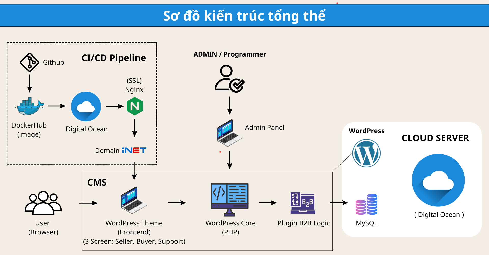
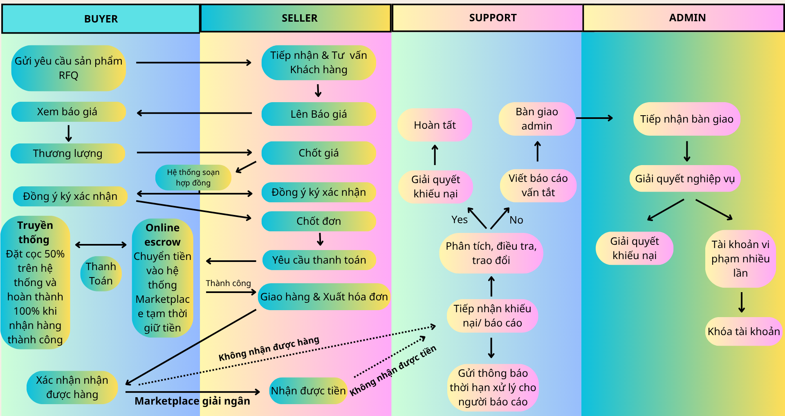
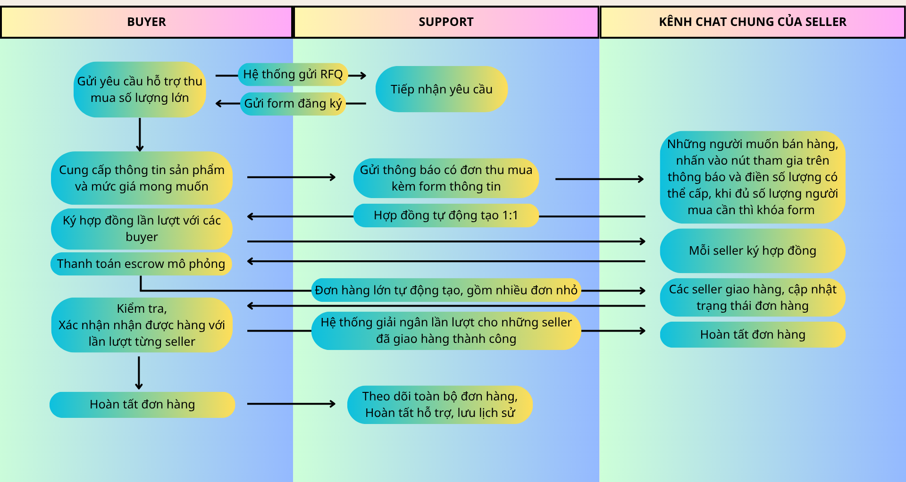
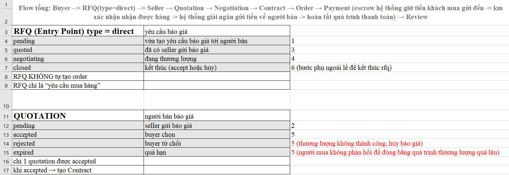
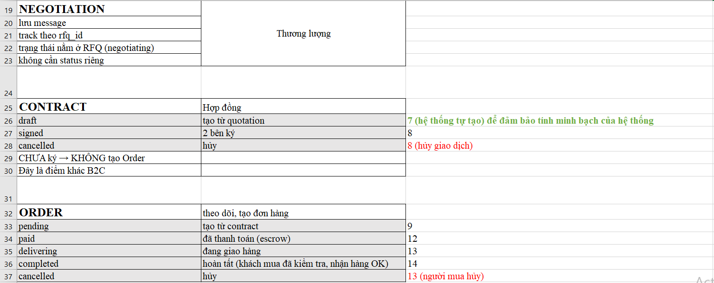
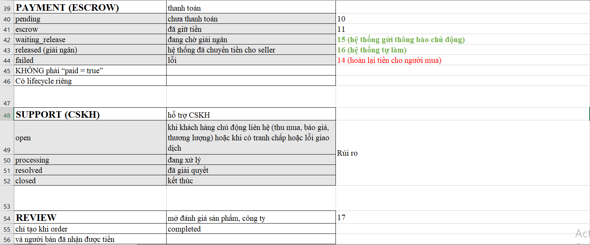
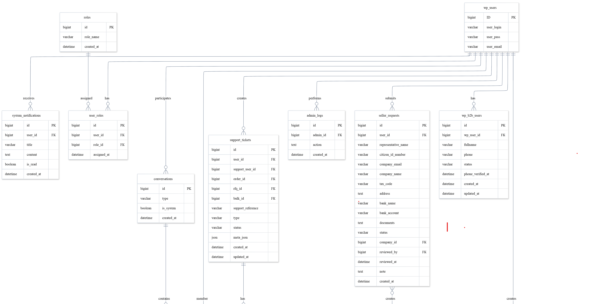
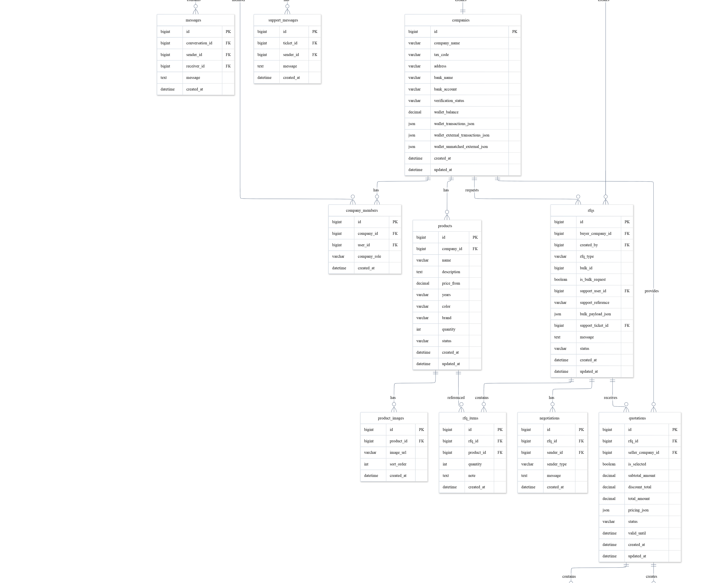
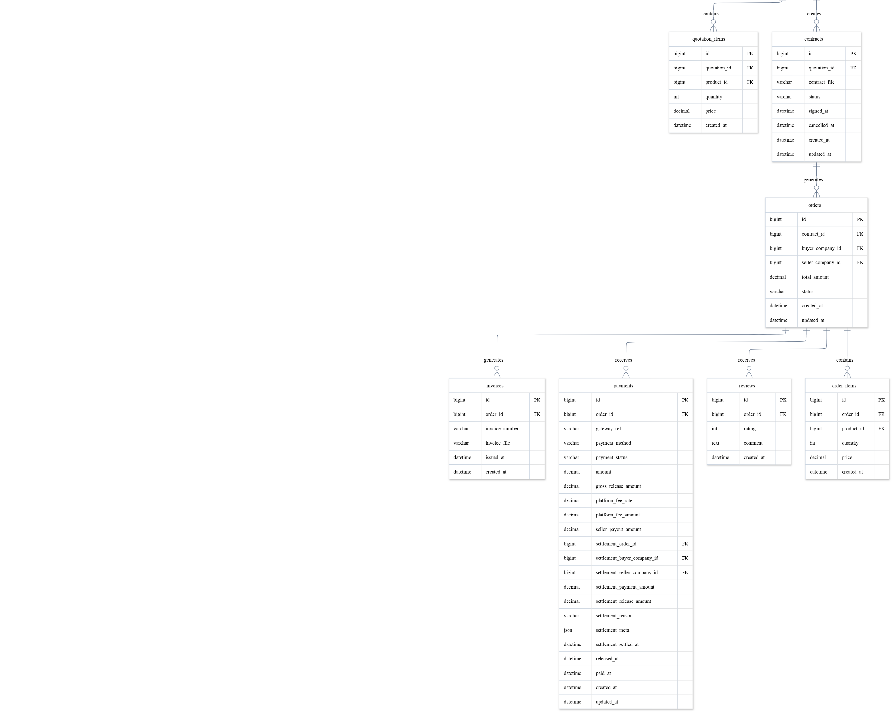
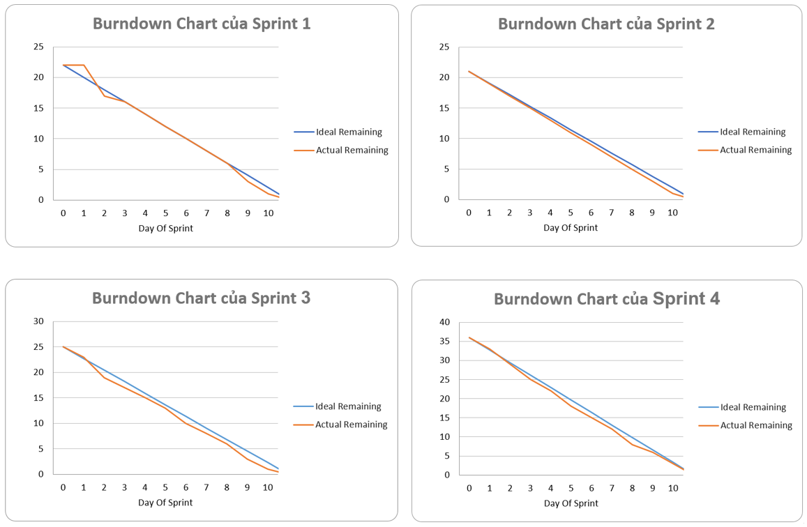

# Sanoto B2B Marketplace 

A Business-to-Business (B2B) Marketplace platform for used automobile trading between enterprises.

This project was developed as a graduation capstone project, focusing on business workflow design, scalable system architecture, API-driven development, and deployment automation.

---

## Live Demo

🌐 Website: https://sanotob2b.com

Note: Please contact us first if you would like to try the full range of services, as some paid third-party services have been temporarily suspended by our team.

---

## Project Overview

Sanoto B2B Marketplace is designed to support the complete vehicle trading lifecycle between businesses instead of individual customers.

Unlike traditional CRUD-based applications, the system is designed around business workflows and state transitions, allowing every transaction to be processed through clearly defined business stages.

Main business modules include:

- Company Management
- Product Management
- RFQ (Request for Quotation)
- Quotation
- Negotiation
- Contract
- Order
- Escrow Payment
- Wallet
- Revenue Management
- Chat
- Notification
- Support Ticket
- AI Assistant

---

## Architecture Overview

Sanoto B2B Marketplace adopts a layered architecture designed around real-world B2B business workflows rather than traditional CRUD operations.

The system is built on **WordPress Bedrock** as the application foundation, using a custom plugin-based backend and **Sage** as the frontend theme. Instead of relying on the default WordPress data model (`wp_posts`, `wp_postmeta`), the platform utilizes a fully customized relational database optimized for enterprise automobile trading.

The backend follows a clean layered architecture based on **MVC**, **Repository Pattern**, and **Service Layer**, exposing RESTful APIs that are consumed by the frontend. Business logic is organized through an **API Flow B2B Business** approach, where each business process is represented as a sequence of workflow-driven APIs instead of isolated CRUD endpoints.

Core business workflows include:

- RFQ (Request for Quotation)
- Quotation
- Negotiation
- Contract
- Order
- Escrow Payment
- Wallet & Revenue Management

Each workflow is governed by a **State Machine**, ensuring that every transaction follows valid business transitions while preventing invalid operations throughout the trading lifecycle.

The entire application is containerized using **Docker**, deployed on **Linux VPS**, and automated through a **GitHub Actions CI/CD pipeline**, enabling consistent builds, reliable deployments, and simplified maintenance.

### Overall System Architecture & Deployment Automation

<p align="center">
    
</p>

<p align="center">
<sub>
Click <a href="docs/images/system-architecture.png">here</a> to view the original image in full resolution.
</sub>
</p>

---

## Key Features

- RESTful API Architecture
- B2B Business Workflow
- State Machine Transaction Management
- JWT Authentication
- Role-Based Authorization (RBAC)
- Dockerized Development Environment
- CI/CD Automation using GitHub Actions
- VPS Deployment with Docker + Nginx
- Responsive Web Interface
- Multi-role Dashboard
- AI Chat Integration
- Email Notification
- Cron Job Scheduler

---

## Technology Stack

### Backend

- PHP 8+
- WordPress Bedrock
- Custom Plugin Architecture
- MVC Pattern
- Repository Pattern
- Service Layer
- REST API

### Frontend

- Sage Theme
- Blade Template
- Tailwind CSS
- JavaScript (ES6)

### Database

- MySQL
- Custom Database Schema (without wp_posts/wp_postmeta)

### Infrastructure

- Docker
- Docker Compose
- GitHub Actions
- Nginx
- Linux VPS

### Development Tools

- Git
- Composer
- Node.js
- npm
- Bud.js

---

## System Highlights

### API Flow B2B Business

Instead of building isolated CRUD modules, the project organizes business logic into workflow-based APIs.

Unlike traditional CRUD APIs, each endpoint represents a business action within the transaction lifecycle, making the workflow easier to understand and maintain.

Each module communicates through well-defined business actions, making the system easier to maintain and extend.

Core Transaction Workflow:
<p align="center">
    
</p>
<p align="center">
<sub>
Click <a href="docs/images/Core-transaction-process.png">here</a> to view the original image in full resolution.
</sub>
</p>

Bulk Purchasing Workflow:
<p align="center">
    
</p>
<p align="center">
<sub>
Click <a href="docs/images/Bulk-purchasing-process.png">here</a> to view the original image in full resolution.
</sub>
</p>

---

### State Machine

Business transactions are controlled using State Machine patterns.

Examples include:

- RFQ Lifecycle
- Quotation Lifecycle
- Contract Lifecycle
- Order Lifecycle
- Escrow Payment Lifecycle

This prevents invalid state transitions and keeps the business process consistent.

State Machine (Part 1)
<p align="center">
    
</p>
<p align="center">
<sub>
Click <a href="docs/images/state-machine-diagrams-a.png">here</a> to view the original image in full resolution.
</sub>
</p>
State Machine (Part 2)
<p align="center">
    
</p>
<p align="center">
<sub>
Click <a href="docs/images/state-machine-diagrams-b.png">here</a> to view the original image in full resolution.
</sub>
</p>
State Machine (Part 3)
<p align="center">
    
</p>
<p align="center">
<sub>
Click <a href="docs/images/state-machine-diagrams-c.png">here</a> to view the original image in full resolution.
</sub>
</p>

---

## Database Design

Instead of relying on the default WordPress data model (`wp_posts`, `wp_postmeta`), the platform uses a fully customized relational database schema specifically designed for B2B automobile trading.

The database consists of business-oriented entities such as RFQ, Quotation, Contract, Order, Wallet, Payment, Company, and Product, allowing the system to support complex business workflows efficiently.

ERD Part 1
<p align="center">
    
</p>
<p align="center">
<sub>
Click <a href="docs/images/erd-a.png">here</a> to view the original image in full resolution.
</sub>
</p>
ERD Part 2
<p align="center">
    
</p>
<p align="center">
<sub>
Click <a href="docs/images/erd-b.png">here</a> to view the original image in full resolution.
</sub>
</p>
ERD Part 3
<p align="center">
    
</p>
<p align="center">
<sub>
Click <a href="docs/images/erd-c.png">here</a> to view the original image in full resolution.
</sub>
</p>

---

## Documentation

Additional diagrams, documents, and original high-resolution images are available under the `docs/` directory.

"docs/images/.."

---

## Project Structure

```
.
├── docs/
├── docker/
├── web/
│   ├── app/
│   │   ├── plugins/
│   │   │     └── b2b-core
│   │   ├── themes/
│   │   │     └── my-theme
│   │   └── uploads/
│   └── config/
├── docker-compose.yml
├── README.md
└── ...
```

---

## Getting Started

### Clone repository

```
git clone https://github.com/NGUYENVODUCCR/B2B-oto.git
```

### Developers cloning the project from GitHub need to perform the following setup

### Step 1

- composer install

### Step 2

- cd web/app/themes/my-theme
- composer install
- npm install

### Step 3

- npm run dev

### From my-theme: run `cd ..` twice to return to web/app

### Step 4

- cd web/app/plugins/b2b-core
- composer init -n
- composer require firebase/php-jwt
- composer require phpmailer/phpmailer

### Step 5

- Follow the setup instructions in the README.md file within b2b-core / my-theme to start coding

Docker deployment instructions are available in:

```
docs/deployment.md
```

---

## Future Improvements

- Azure Cloud Deployment
- Kubernetes
- Infrastructure as Code
- Monitoring & Logging
- Automated Testing
- Microservices Migration

---

## Acknowledgements

This project was developed as a university graduation capstone project.

Special thanks to all team members for their collaboration throughout the design, implementation, testing, deployment, and documentation phases.

---

## License

This repository is published for educational and portfolio purposes.

Commercial use requires permission from the project owner.

---

## Author (Team Development)

- Nguyễn Võ Đức (Team Leader / Scrum Master): Backend Development, Frontend Development, Database Design, UI/UX Design (Figma), Framework, System Architecture, CI/CD & Deployment, Project Management, Documentation, Testing.

- Đỗ Kỳ Hà: Backend Development, Frontend Development, Database Design, UI/UX Design (Figma), Framework, System Architecture, Sprint Planning & Documentation, Deployment, Testing.

- Huỳnh Đức Hiếu: Backend Development, Frontend Development, Database Design, UI/UX Design (Figma), System Architecture, Deployment, Documentation, Testing.

- Võ Ngọc Lâm: Swagger API Documentation, UI/UX Design (Figma), Frontend Framework Support, Documentation, Deployment, Testing.

---

### Collaboration

Throughout the project, team members collaborated across multiple areas including software design, implementation, testing, deployment, documentation, and Agile/Scrum activities. While each member had primary responsibilities, we frequently reviewed each other's work, discussed technical solutions, and supported one another to ensure the project was delivered successfully.

---

### Development Methodology

This project was developed following the Agile Scrum framework.

The team completed multiple sprints including:

Main:
- Product Backlog
- Sprint Planning
- Sprint Backlog
- Burndown Chart

Secondary:
- Sprint Review
- Sprint Retrospective
- Daily Scrum

Example Sprint Burndown:
<p align="center">
    
</p>

<p align="center">
<sub>
Click <a href="docs/images/scrum-burndown-chart.png">here</a> to view the original image in full resolution.
</sub>
</p>

----
### Have a nice day.